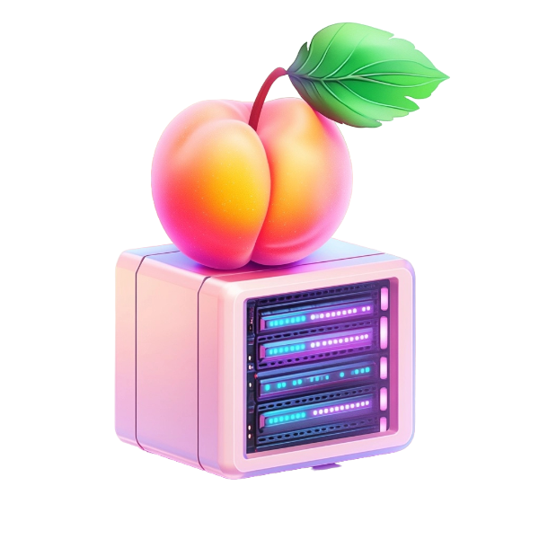

  <picture>
      
  </picture>

  
  
  
  

## 🍑 Features

### 🎮 Dummy Thicc Dedicated Game Servers

Deploy game servers faster than you can say "ASS":

- Optimize for booty or bounty, servers starting at $6.9/mo for 4.20 servers
- Auto-scales 69% faster than AWS GameLift (because we said so)
- No-downtime deploys & instant twerk-backs
- Monitoring & crash reporting (we've got your back[side])

### 🛡️ DDoASS Mitigation

- No added jiggle
- Supports UDP & TCP & WebSockets & WebRTC (all dat ASS)
- Automatic SSL for game servers (because security is sexy)

### 🌐 Content Delivery Network (CDN)

Asset delivery, game downloads, & website hosting:

- Custom domains (make dat ASS yours)
- Instant twerk-backs
- Automatic SSL (Safe Sensual Layer)

### 🧩 Backend Modules

Write server-side logic using THICC++ (or use your own API server):

- Modules include matchmaking, parties, authentication, & more
- Combine open-source modules to build your backend - Open dat ASS up

### 🚙 Supported Game Engines

- Godot
- Unity
- Unreal Engine
- HTML5 & JS
- Rust
- Other

## 🌶️ Endorsements

- [ThePrimeagen](https://x.com/ThePrimeagen) says "A lot of people just don't learn a tool ... and then create another tool, which is just annoying" – [Clip](https://www.twitch.tv/theprimeagen/clip/FrigidHeartlessBananaRuleFive-MJmhAQ3gr2gcGSwX)
- [k8s.af]((https://k8s.af)) says "At least ASS won't make you cry as much as Kubernetes" - [Kubernetes Failure Stories]
- [AWS Pricing Calculator](https://calculator.aws/#/) says "We can't compete with these dummy thicc prices"

## 🚀 Getting Started

1. Clone dat ASS
2. Shake it
3. Deploy it

## 🍑 vs 🫓: Why Choose ASS?

| Feature           | ASS (Autoscaling Server Service) | AWS (A Wallet Sucker) | DigitalOcean (Droplet Drown) | Kubernetes (Komplicated Mess) | DIY (Disaster It Yourself) |
|-------------------|----------------------------------|----------------------|------------------------------|-------------------------------|----------------------------|
| Scaling Speed     | Dummy Thicc                      | Slower than my ex    | Like watching paint dry      | Eventually... maybe           | What's scaling?            |
| Reliability       | Tight like yoga pants            | 99.9% of the time    | Hope you can swim            | Depends on your YAML skills   | Pray to the server gods    |
| Performance       | Bouncy and responsive            | Pay more to go fast  | Floats when not sinking      | Lost in a sea of pods         | As good as your hardware   |
| Customer Support  | We've got your backside 24/7     | "Have you tried AWS docs?" | "Here's a floatie"     | Stack Overflow is your friend | You're on your own, buddy  |
| Meme Potential    | Over 9000                        | Jeff Bezos' piggy bank | Wet memes only            | YAML indentation jokes        | Unlimited (mostly tears)   |
| Cost              | Thicc value for your buck        | Hope you like ramen  | Affordable until you scale   | Hidden costs everywhere       | Your sanity + $$           |
| Setup Time        | Faster than you can say "ASS"    | Slower than a sloth  | Drowning in droplets         | "It's been 84 years..."       | How's your weekend looking? |

Remember: With ASS, there's no need to clench - we keep it tight so you don't have to. Why settle for less when you can have a piece of ASS?

## 📐 Architecture

Our architecture is THICC. Trust us, you'll really want to dive right in.

## 🚫 What ASS is NOT

- Not Kubernetes (because who needs that many syllables?)
- Not written in fake languages like "Go" or "Java" (we use REAL languages like THICC++ and ASSembly)
- Not a joke (okay, maybe a little)

## License

THICC-2.0 (Totally Hilarious Intentionally Comedic Copyleft)

_In ASS we trust, all others pay cash_
